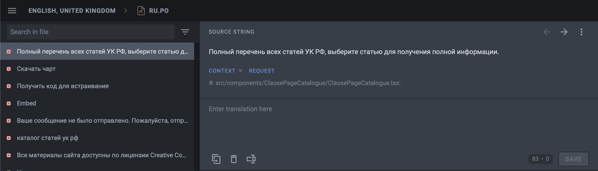
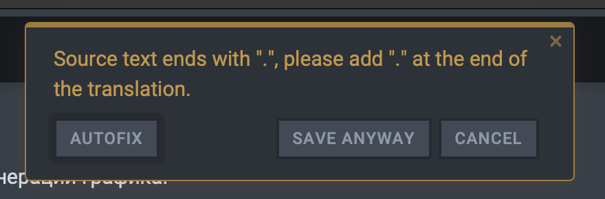
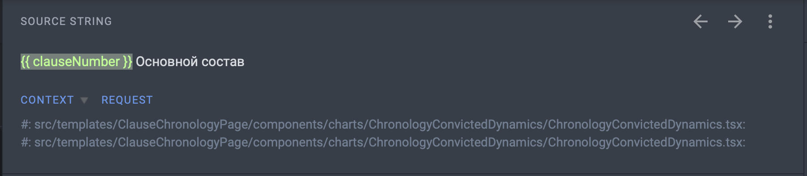
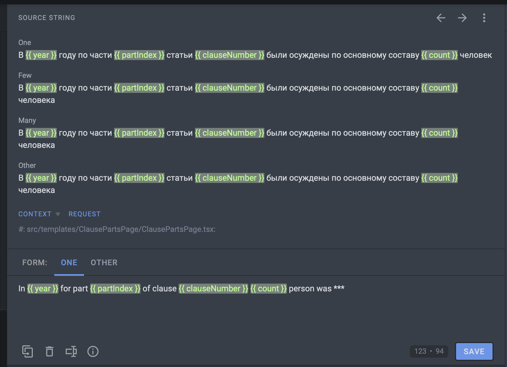

# Достоевский

   

[Ссылка на сайт](https://dostoevsky.io/) | [Ссылка на бету](https://beta.dostoevsky.io/) | [Ссылка на Storybook](https://storybook.dostoevsky.io)

  

### Feature Flags

- `langs=1` (https://beta.dostoevsky.io/ru/?langs=1) - активирует выбор языка
- `analytics=1` (https://beta.dostoevsky.io/ru/?analytics=1) - активирует ссылку Аналитика

### Полезные ссылки

- [Интерактивный прототип сайта](https://www.figma.com/proto/ATV2uD5P5pHjNbnQHs2YB2/Sasha's-Team-Colors?node-id=686%3A4546)
- [Дизайн](https://www.figma.com/file/ATV2uD5P5pHjNbnQHs2YB2/Sasha's-Team-Colors)
- [Документация](https://docs.google.com/document/d/1UiDOOroIXw4wTsjwwhm5uhZ2CzYFXzXc_oECGrwsgg4/edit?ts=5f188437)
- [Названия колонок на русском](https://docs.google.com/document/d/1Mmc-QWchjd1oxy6gHVGP1Lb6pIMj2IowQWc9Y4dpm-k/edit)

### Cheatsheet

- Используй ветку `develop` в качестве основной ветки
- Для более быстрой локальной разработки используй `npm run develop:semi`. В этом режиме сайт генерирует не все страницы статей, а лишь первый раздел УК РФ.

### Перевод сайта

"Достоевский" – открытый проект. Каждый может стать переводчиком!

- Система переводов доступна [по данной ссылке](https://crowdin.com/project/dostoevsky).
- После открытия страницы надо выбрать язык для перевода.
- Нажать на `Translate All` в верхнем правом углу.
- Если вы впервые пользуетесь системой Crowdin, вам предложат зарегистрироваться в системе. Можно использовать **вход через социальную сеть**.
- В самой системе перевода слева вы видете предложение для перевода, справа окно для ввода перевода. После ввода перевода надо нажать на кнопку "Save".
  
- Если предложение для перевода заканчивается на точку, то и в переводе необходимо ставить точку в конце приложения. Если предложение начинается с маленькой буквы - то и перевод должен начинаться с маленькой буквы. Но не бойтесь, система сама подскажет что делать в случае ошибки.
  
- Если в предложении для перевода есть текст в фигурных скобках (например `{{ clauseNumber }}`), то его переводить не надо. Сайт подставит цифры/слово в это место.
  
- Есть предложения с числительными. В них необходимо давать несколько форм перевода. Для английского, например, их всего две: "One" (для одного предмета) и "Other" (для нескольких). Например, фразу `{{ count }} человек` нужно перевести как `{{ count }} person` в форме "One" и `{{ count }} people` для формы "Other".
  
